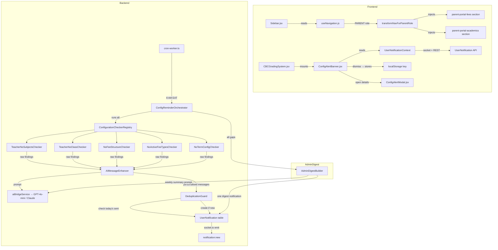
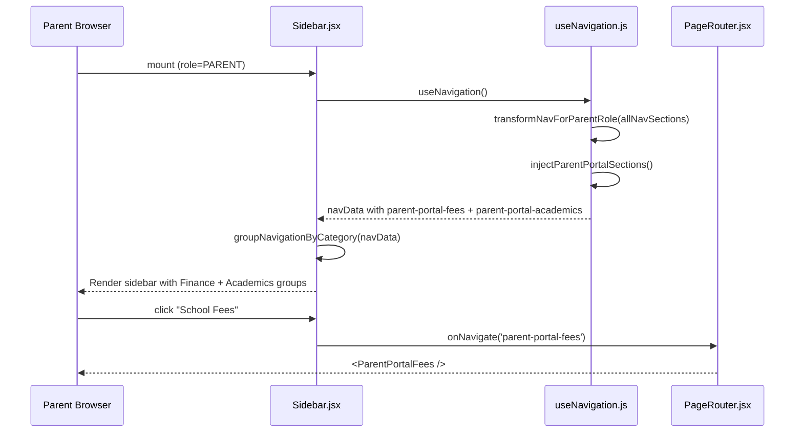
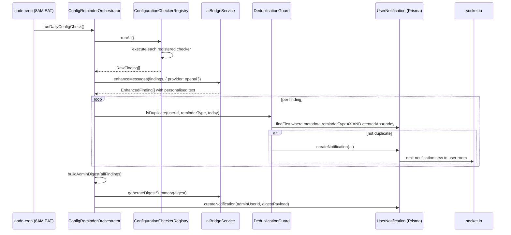
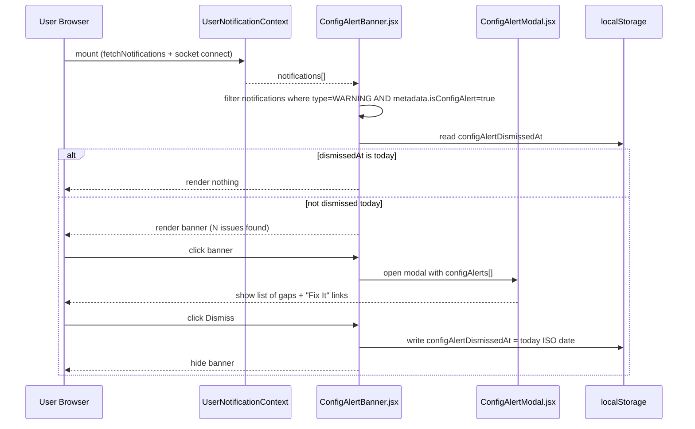

# Design Document: Parent Portal Enhancements

## Overview

Three interconnected features that elevate the parent experience and keep the entire school team on top of configuration health:

1. **Parent Portal Desktop Sidebar** — adds "School Fees" and "Academics" sections (with sub-items) to the existing `Sidebar.jsx`, giving parents on desktop the same rich navigation that the mobile portal already exposes via quick-action tiles.
2. **Global Configuration Reminder Engine** — a pluggable, AI-enhanced backend system that runs daily at 8 AM EAT, checks for misconfigured entities school-wide, and fires personalised in-app notifications to the right people.
3. **In-App Configuration Alert Banner** — a dismissable frontend overlay that surfaces unresolved configuration gaps on login, with a "Fix It" modal containing deep-links to every affected settings page.

---

## Architecture



---

## Sequence Diagrams

### Feature 1: Parent Opens Sidebar (Desktop)



### Feature 2: Daily Cron — Configuration Reminder Engine



### Feature 3: User Logs In — Config Alert Banner



---

## Components and Interfaces

### Frontend — Feature 1: Parent Sidebar Sections

#### `useNavigation.js` — `injectParentPortalSections()`

A new pure function injected into `transformNavForParentRole` that appends two synthetic nav sections after the existing parent-visible sections are built.

```typescript
interface ParentNavSection {
  id: string           // 'parent-portal-finance' | 'parent-portal-academics'
  label: string
  icon: LucideIcon
  items: ParentNavItem[]
  portalSection: true  // discriminator so Sidebar can skip getCollapsedIconColor lookup
}

interface ParentNavItem {
  id: string
  label: string
  path: string         // e.g. 'parent-portal-fees'
  badge?: BadgeSpec    // optional pill shown in collapsed + expanded modes
}

interface BadgeSpec {
  content: string      // 'KES 4,200' | '✓ Cleared' | number
  variant: 'danger' | 'success' | 'neutral'
}
```

**Responsibilities:**
- Return a "School Fees" section with one item: `parent-portal-fees`
- Return an "Academics" section with three items: Results (`parent-portal-results`), Attendance (`parent-portal-attendance`), Children (`parent-portal-children`)
- These sections are injected into `backOfficeSections` so `groupNavigationByCategory` places "School Fees" in the Finance group and "Academics" in the Academics group automatically

#### `FeeBadgeProvider` context (lightweight)

A small React context that fetches `dashboardAPI.getParentMetrics()` once on mount and exposes the total outstanding balance. The sidebar fee item reads from this context to render a badge without triggering a full page refetch.

```typescript
interface FeeBadgeContextValue {
  totalBalance: number | null   // null = loading
  isCleared: boolean
}
```

#### `Sidebar.jsx` — `getCollapsedIconColor` additions

Two new cases are added to the existing switch:

```typescript
case 'parent-portal-finance':
  return 'text-rose-500 drop-shadow-[0_0_6px_rgba(244,63,94,0.7)] group-hover:text-rose-400 ...'
case 'parent-portal-academics':
  return 'text-amber-500 drop-shadow-[0_0_6px_rgba(245,158,11,0.7)] group-hover:text-amber-400 ...'
```

#### `ParentNavLeafItem` sub-component

A thin wrapper around the existing `LeafItem` that additionally renders a `BadgeSpec` pill when present.

---

### Backend — Feature 2: Configuration Reminder Engine

#### `ConfigurationChecker` interface

```typescript
// server/src/services/config-reminder/types.ts

export interface RawFinding {
  userId: string           // who should receive the notification
  userName: string         // used in AI prompt personalisation
  userRole: string         // 'TEACHER' | 'ADMIN' | 'OWNER'
  reminderType: ConfigReminderType
  severity: 'INFO' | 'WARNING' | 'CRITICAL'
  title: string            // fallback if AI enhancement fails
  message: string          // fallback message
  link: string             // deep-link e.g. 'assess-learning-areas'
  context: Record<string, unknown>  // extra data for AI prompt
}

export interface EnhancedFinding extends RawFinding {
  aiTitle: string
  aiMessage: string
  aiEnhanced: boolean
}

export type ConfigReminderType =
  | 'CONFIG_TEACHER_NO_SUBJECTS'
  | 'CONFIG_TEACHER_NO_CLASS'
  | 'CONFIG_NO_FEE_STRUCTURE'
  | 'CONFIG_NO_FEE_TYPES'
  | 'CONFIG_NO_TERM_CONFIG'
  | 'CONFIG_ADMIN_DIGEST'

export interface ConfigurationChecker {
  readonly reminderType: ConfigReminderType
  readonly targetRoles: string[]
  check(): Promise<RawFinding[]>
}
```

#### `ConfigurationCheckerRegistry`

```typescript
// server/src/services/config-reminder/registry.ts

export class ConfigurationCheckerRegistry {
  private checkers: ConfigurationChecker[] = []

  register(checker: ConfigurationChecker): this
  getAll(): ConfigurationChecker[]
  async runAll(): Promise<RawFinding[]>
    // Runs all checkers concurrently via Promise.allSettled
    // Logs and swallows individual checker failures so one bad checker
    // cannot block the others
}
```

#### Five Initial Checkers

| Checker | Table queried | Finding condition | Target |
|---|---|---|---|
| `TeacherNoSubjectsChecker` | `SubjectAssignment` | Teacher has 0 active subject assignments | That teacher's userId |
| `TeacherNoClassChecker` | `Class` (teacherId field) | Teacher not assigned as class teacher anywhere | That teacher's userId |
| `NoFeeStructureChecker` | `FeeStructure` | 0 FeeStructure rows exist for current term/year | All ADMIN / OWNER users |
| `NoActiveFeeTypesChecker` | `FeeType` | 0 active FeeType rows | All ADMIN / OWNER users |
| `NoTermConfigChecker` | `TermConfig` | 0 TermConfig for current year | All ADMIN / OWNER users |

#### `AIMessageEnhancer`

```typescript
// server/src/services/config-reminder/ai-enhancer.ts

export class AIMessageEnhancer {
  constructor(private ai: AIBridgeService) {}

  async enhance(findings: RawFinding[]): Promise<EnhancedFinding[]>
    // Groups findings by type, builds a single batched prompt
    // Uses jsonMode:true to get a structured array back
    // Falls back to raw title/message on AI error (non-throwing)
    // maxTokens: 800 per batch, temperature: 0.6

  private buildPrompt(findings: RawFinding[]): string
    // System: "You are a friendly school management assistant..."
    // User: JSON array of {userName, reminderType, context}
    // Returns: JSON array of {userId, title, message}
}
```

#### `DeduplicationGuard`

```typescript
// server/src/services/config-reminder/dedup-guard.ts

export class DeduplicationGuard {
  async isDuplicate(userId: string, reminderType: ConfigReminderType): Promise<boolean>
    // prisma.userNotification.findFirst({
    //   where: {
    //     userId,
    //     metadata: { path: ['reminderType'], equals: reminderType },
    //     createdAt: { gte: startOfToday() }
    //   }
    // })

  async bulkFilter(findings: EnhancedFinding[]): Promise<EnhancedFinding[]>
    // Returns only findings that have not been sent today
}
```

#### `ConfigReminderOrchestrator`

```typescript
// server/src/services/config-reminder/orchestrator.ts

export class ConfigReminderOrchestrator {
  constructor(
    private registry: ConfigurationCheckerRegistry,
    private enhancer: AIMessageEnhancer,
    private dedup: DeduplicationGuard,
    private notificationService: typeof NotificationService
  ) {}

  async runDailyConfigCheck(): Promise<void>
    // 1. registry.runAll() → RawFinding[]
    // 2. enhancer.enhance(findings) → EnhancedFinding[]
    // 3. dedup.bulkFilter(enhanced) → filtered[]
    // 4. For each: NotificationService.createNotification({
    //      userId, title: aiTitle, message: aiMessage,
    //      type: WARNING, link, showAsPopup: false,
    //      metadata: { reminderType, isConfigAlert: true, severity }
    //    })
    // 5. buildAndSendAdminDigest(allRawFindings)

  private async buildAndSendAdminDigest(findings: RawFinding[]): Promise<void>
    // Groups findings by reminderType
    // Generates a weekly-style digest summary via AI
    // Sends one WARNING notification to each ADMIN/OWNER user
    // with metadata: { reminderType: 'CONFIG_ADMIN_DIGEST', isConfigAlert: true }
}
```

---

### Frontend — Feature 3: ConfigAlertBanner + ConfigAlertModal

#### `ConfigAlertBanner.jsx`

```typescript
interface ConfigAlertBannerProps {
  onNavigate: (path: string) => void
}

// Internal logic:
// 1. const { notifications } = useUserNotifications()
// 2. configAlerts = notifications.filter(
//      n => n.metadata?.isConfigAlert === true && !n.isRead
//    )
// 3. dismissedKey = `configAlertDismissedAt_${user.id}`
// 4. dismissedAt = localStorage.getItem(dismissedKey)
// 5. if (dismissedAt === todayISO || configAlerts.length === 0) return null
// 6. Render a fixed top banner with count, brief text, and two actions:
//      - "Review" → open ConfigAlertModal
//      - "✕"      → set localStorage and hide
```

**Visual design:**
- `fixed top-[72px] left-0 right-0 z-40` (below the 72px Header)
- Amber-600 background with white text when count ≤ 3
- Rose-600 background for count > 3 (CRITICAL threshold)
- Left accent bar in matching darker shade
- Animated slide-down entry via Tailwind `translate-y` transition

#### `ConfigAlertModal.jsx`

```typescript
interface ConfigAlertModalProps {
  alerts: UserNotification[]       // pre-filtered config alerts
  onClose: () => void
  onNavigate: (path: string) => void
}

// Renders:
// - Title: "🔧 X Configuration Items Need Attention"
// - Scrollable list, each item shows:
//     icon (by reminderType), title, message, severity badge, "Fix It →" button
// - "Fix It →" calls onNavigate(alert.link) + onClose()
// - "Mark All Read" button at bottom → markAllAsRead() from context
```

---

## Data Models

### `UserNotification` metadata schema for config alerts

The existing `UserNotification` Prisma model has a `metadata: Json?` field. Config alert notifications use the following structure:

```typescript
interface ConfigAlertMetadata {
  reminderType: ConfigReminderType
  isConfigAlert: true           // flag for frontend filtering
  severity: 'INFO' | 'WARNING' | 'CRITICAL'
  affectedCount?: number        // e.g. number of teachers with no subjects
  link: string                  // navigation path for "Fix It"
  aiEnhanced: boolean
  generatedAt: string           // ISO timestamp
}
```

### localStorage schema for banner dismissal

```typescript
// Key:   `configAlertDismissedAt_${userId}`
// Value: ISO date string, e.g. "2026-06-24"
// Usage: compare to new Date().toISOString().slice(0, 10)
//        if equal → banner stays hidden for the rest of today
```

---

## Key Functions with Formal Specifications

### `injectParentPortalSections(sections: NavSection[]): NavSection[]`

**Preconditions:**
- `sections` is the array returned by `transformNavForParentRole` — already stripped of non-parent items
- Role is confirmed `PARENT` at call site

**Postconditions:**
- Returns `sections` with two additional entries appended:
  1. `{ id: 'parent-portal-finance', label: 'School Fees', icon: Receipt, items: [feeItem] }`
  2. `{ id: 'parent-portal-academics', label: 'Academics', icon: GraduationCap, items: [resultsItem, attendanceItem, childrenItem] }`
- Does not mutate the input array
- All injected items have valid `path` values matching PageRouter `case` labels

**Loop Invariants:** N/A (no loops — array spread)

---

### `ConfigurationCheckerRegistry.runAll(): Promise<RawFinding[]>`

**Preconditions:**
- At least one checker is registered
- Database connection is available

**Postconditions:**
- Returns the union of all `RawFinding[]` from every registered checker
- If a checker throws, its error is logged and its findings are omitted (no rethrow)
- Return value is always an array (never throws)

**Loop Invariants:**
- Each settled `Promise` either contributes its findings or contributes zero findings; the running total only grows

---

### `DeduplicationGuard.bulkFilter(findings): Promise<EnhancedFinding[]>`

**Preconditions:**
- `findings` is a non-empty array of `EnhancedFinding`
- Each finding has a valid `userId` and `reminderType`

**Postconditions:**
- Returns only findings where no `UserNotification` with the same `userId + reminderType` was created since midnight today (UTC)
- Does not mutate input
- Result length ≤ input length

**Loop Invariants:**
- For each checked finding: if `isDuplicate = true`, it is excluded; if `false`, it is included

---

### `getReminderDelay` (existing, extended)

The existing utility in `notificationReminder.js` is unchanged. The config alert banner uses a simpler localStorage-based date check instead of the millisecond-delay system, since the banner should appear once per calendar day rather than after a session timeout.

---

## Algorithmic Pseudocode

### Main Algorithm: Daily Configuration Check

```pascal
ALGORITHM runDailyConfigCheck()
INPUT:  none (reads from database)
OUTPUT: none (side-effects: notifications created, socket events emitted)

BEGIN
  LOG '[ConfigReminder] Starting daily check'
  
  // Step 1: Collect raw findings from all checkers
  rawFindings ← registry.runAll()
  
  IF rawFindings IS EMPTY THEN
    LOG '[ConfigReminder] No configuration gaps found today — all good!'
    RETURN
  END IF
  
  LOG '[ConfigReminder] Found ' + rawFindings.length + ' raw findings'
  
  // Step 2: AI-enhance messages (with graceful fallback)
  TRY
    enhanced ← await enhancer.enhance(rawFindings)
  CATCH aiError
    LOG '[ConfigReminder] AI enhancement failed, using raw messages:', aiError
    enhanced ← rawFindings.map(f => { ...f, aiTitle: f.title, aiMessage: f.message, aiEnhanced: false })
  END TRY
  
  // Step 3: Deduplicate — only send if not already sent today
  toSend ← await dedup.bulkFilter(enhanced)
  
  LOG '[ConfigReminder] After dedup: ' + toSend.length + ' notifications to create'
  
  // Step 4: Persist and emit via socket
  FOR each finding IN toSend DO
    ASSERT finding.userId IS non-empty
    ASSERT finding.reminderType IS valid ConfigReminderType
    
    await NotificationService.createNotification({
      userId:      finding.userId,
      title:       finding.aiTitle,
      message:     finding.aiMessage,
      type:        WARNING,
      link:        finding.link,
      showAsPopup: false,
      metadata: {
        reminderType: finding.reminderType,
        isConfigAlert: true,
        severity:      finding.severity,
        aiEnhanced:    finding.aiEnhanced,
        generatedAt:   NOW().toISOString()
      }
    })
  END FOR
  
  // Step 5: Admin digest (separate notification, one per admin)
  await buildAndSendAdminDigest(rawFindings)
  
  LOG '[ConfigReminder] Daily check complete'
END
```

**Preconditions:**
- Database connection is active
- `registry` has at least one checker registered
- `NotificationService` is importable and functional

**Postconditions:**
- For each finding that was not already sent today: one `UserNotification` row exists with `metadata.isConfigAlert = true`
- Admin/Owner users received a digest notification if any findings existed
- No duplicate notifications for the same `(userId, reminderType)` on the same calendar day

---

### Algorithm: Frontend Banner Visibility Decision

```pascal
ALGORITHM shouldShowConfigBanner(notifications, userId)
INPUT:  notifications (UserNotification[]), userId (string)
OUTPUT: { show: boolean, alerts: UserNotification[] }

BEGIN
  // Filter to unread config alerts only
  configAlerts ← notifications.filter(n =>
    n.metadata?.isConfigAlert = true AND
    n.isRead = false
  )
  
  IF configAlerts IS EMPTY THEN
    RETURN { show: false, alerts: [] }
  END IF
  
  // Check localStorage dismissal
  dismissKey ← 'configAlertDismissedAt_' + userId
  dismissedAt ← localStorage.getItem(dismissKey)
  todayISO ← new Date().toISOString().slice(0, 10)
  
  IF dismissedAt = todayISO THEN
    RETURN { show: false, alerts: configAlerts }
  END IF
  
  RETURN { show: true, alerts: configAlerts }
END
```

**Preconditions:**
- `notifications` is the live array from `UserNotificationContext`
- `userId` is the authenticated user's ID (used as part of the storage key to prevent cross-user bleed)

**Postconditions:**
- Returns `show: false` if dismissed today OR if no unread config alerts exist
- Returns `show: true` with the full unread alert list otherwise
- Does not mutate `notifications`

---

## Example Usage

### Adding a New Checker (Extensibility Demo)

```typescript
// server/src/services/config-reminder/checkers/no-timetable.checker.ts

import { ConfigurationChecker, RawFinding } from '../types'
import prisma from '../../config/database'

export class NoTimetableChecker implements ConfigurationChecker {
  readonly reminderType = 'CONFIG_NO_TIMETABLE' as const
  readonly targetRoles = ['ADMIN', 'OWNER']

  async check(): Promise<RawFinding[]> {
    const currentYear = new Date().getFullYear()
    const scheduleCount = await prisma.classSchedule.count({
      where: { academicYear: currentYear, archived: false }
    })

    if (scheduleCount > 0) return []

    const admins = await prisma.user.findMany({
      where: { role: { in: ['ADMIN', 'OWNER'] }, status: 'ACTIVE', archived: false },
      select: { id: true, firstName: true, role: true }
    })

    return admins.map(admin => ({
      userId:       admin.id,
      userName:     admin.firstName,
      userRole:     admin.role,
      reminderType: this.reminderType,
      severity:     'WARNING',
      title:        'No Timetable Created',
      message:      'No class schedules exist for the current academic year.',
      link:         'planner-timetable',
      context:      { currentYear, scheduleCount: 0 }
    }))
  }
}

// Register in orchestrator bootstrap:
registry.register(new NoTimetableChecker())
```

### Parent Sidebar Fee Badge (collapsed mode)

When the sidebar is collapsed, the fee item shows a small coloured dot indicator instead of the full badge text. The dot is red if `totalBalance > 0`, green if `isCleared`, hidden if `loading`.

```typescript
// Inside ParentNavLeafItem
const dot = badge
  ? <span className={`absolute top-2 right-2 w-2 h-2 rounded-full ${
      badge.variant === 'danger'  ? 'bg-red-500' :
      badge.variant === 'success' ? 'bg-emerald-500' : 'bg-gray-400'
    }`} />
  : null
```

### AI Prompt Structure (batched)

```typescript
const systemPrompt = `You are a friendly, encouraging assistant in a Kenyan school management system.
Given a list of configuration issues, write a SHORT, warm, personalised notification message for each.
Each message should name the person, describe the gap concisely, and end with an action hint.
Max 2 sentences per message. Return a JSON array: [{userId, title, message}]`

const userPrompt = JSON.stringify(findings.map(f => ({
  userId:      f.userId,
  userName:    f.userName,
  type:        f.reminderType,
  context:     f.context
})))
```

---

## Error Handling

### Scenario 1: AI Bridge Unavailable

**Condition:** `aiBridgeService.generateCompletion()` throws (network error, API key missing, rate-limited)

**Response:** `AIMessageEnhancer.enhance()` catches the error, logs a warning, and returns all findings with `aiEnhanced: false`, using the checker's static `title` and `message` strings as fallback.

**Recovery:** The next day's cron run will attempt AI enhancement again. No notification is lost.

---

### Scenario 2: Duplicate Notification Race (two cron instances)

**Condition:** In a multi-container deployment, two cron workers fire simultaneously and both pass the deduplication check before either has written to the database.

**Response:** `DeduplicationGuard.bulkFilter` uses an optimistic approach (read-then-write), so a duplicate is theoretically possible. The `UserNotification` table has no unique constraint on `(userId, reminderType, date)`. The impact is a user receives the same notification twice in one day — a cosmetic issue.

**Recovery:** A `@@unique` constraint or Prisma `upsert` on `(userId, reminderType, createdDate)` can be added in a follow-up migration if multi-instance deployment is confirmed. For now, the single cron container avoids this.

---

### Scenario 3: Parent Has No Children Linked

**Condition:** A PARENT user account has no learners linked (empty `Learner[]` from `parentId` relation). `FeeBadgeProvider` calls `dashboardAPI.getParentMetrics()` which returns an empty children array.

**Response:** `totalBalance = 0`, `isCleared = false` (indeterminate state). The sidebar fee item renders without a badge rather than showing an incorrect "✓ Cleared".

**Recovery:** Badge is shown only when `children.length > 0`.

---

### Scenario 4: Config Alert Modal — Stale Notifications After Fix

**Condition:** An admin fixes a configuration gap (adds fee types), but the ConfigAlertModal still shows that gap because the notification is unread.

**Response:** The "Fix It →" button calls `onNavigate(link)` and closes the modal. The notification is not auto-marked-read (the user may want to read it). A "Mark All Read" button at the bottom of the modal allows bulk dismissal.

**Recovery:** Once marked read, `UserNotificationContext` recalculates `configAlerts` and the banner disappears automatically on next render.

---

## Testing Strategy

### Unit Testing Approach

- Each `ConfigurationChecker` should be tested with a Prisma mock that returns both "gap exists" and "no gap" scenarios
- `DeduplicationGuard` tested with a mocked `prisma.userNotification.findFirst` returning found/not-found
- `AIMessageEnhancer` tested with a mocked `aiBridgeService` and a fallback path where the mock throws
- `injectParentPortalSections` is a pure function — test that it returns exactly the two expected sections appended and does not mutate input

### Property-Based Testing Approach

**Property Test Library:** fast-check (already used in the project based on `*.test.js` patterns)

- **Sidebar injection**: For any array of nav sections, `injectParentPortalSections` always appends exactly 2 sections, never reduces input length, and all injected items have non-empty `path` values
- **Deduplication**: For any finding, if a notification with the same `(userId, reminderType)` exists today, `bulkFilter` never includes it in the output
- **Banner visibility**: `shouldShowConfigBanner` never returns `show: true` when `configAlerts.length === 0`, and never returns `show: true` on the same calendar day the user dismissed the banner

### Integration Testing Approach

- Cron trigger test: call `orchestrator.runDailyConfigCheck()` against a seeded test DB where one teacher has no subjects; assert one `UserNotification` row is created with correct metadata
- Socket emission test: assert `socket.io` room emit fires when notification is created
- End-to-end sidebar test: mount `Sidebar` with `role=PARENT`, assert the Finance and Academics groups are present and navigation items have correct paths

---

## Performance Considerations

- The five initial checkers each run a `count` or `findMany` query. All should complete in < 50ms individually. `Promise.allSettled` runs them concurrently, so total DB time is bounded by the slowest checker, not their sum.
- `AIMessageEnhancer` makes a single batched API call per run, not one per finding. For 20 findings this is one HTTP request rather than 20.
- `FeeBadgeProvider` uses the existing `dashboardAPI.getParentMetrics()` call that the `ParentDashboard` already makes. It should be hoisted into a shared context so it is only called once per session, not once per sidebar render.
- The banner's `configAlerts` filter runs on the already-fetched `notifications` array (client-side filter) — no additional API call.

---

## Security Considerations

- Configuration reminder notifications are created server-side by the cron worker, not via a user-facing API. No user can trigger or forge a config alert notification.
- The `metadata.isConfigAlert = true` flag is set only by the server; the frontend uses it only for display filtering.
- The `localStorage` dismissal key is scoped by `userId` (`configAlertDismissedAt_${userId}`) to prevent a shared-browser scenario where one user's dismissal hides alerts for another.
- The AI prompt sends only `userName`, `reminderType`, and structured context counts — no PII beyond first name, no raw database records.

---

## Dependencies

| Area | Dependency | Already present |
|---|---|---|
| Backend | `node-cron` | ✅ |
| Backend | `@prisma/client` | ✅ |
| Backend | `AIBridgeService` | ✅ |
| Backend | `NotificationService` | ✅ |
| Frontend | `UserNotificationContext` | ✅ |
| Frontend | `lucide-react` (Receipt, GraduationCap, BarChart2, Users, AlertTriangle) | ✅ |
| Frontend | `socket.io-client` | ✅ |
| Frontend | `dashboardAPI.getParentMetrics` | ✅ |
| New backend files | `server/src/services/config-reminder/` directory with 5 files | ❌ new |
| New frontend files | `ConfigAlertBanner.jsx`, `ConfigAlertModal.jsx`, `FeeBadgeProvider.jsx` | ❌ new |
| New nav function | `injectParentPortalSections` in `useNavigation.js` | ❌ new |

No new npm packages required. All capabilities are available through existing dependencies.

---

## Correctness Properties

The following properties must hold universally across all inputs and states.

### Property 1: Sidebar injection is additive

**P1 — Sidebar injection is additive:**
For any valid array of parent nav sections `S`, `injectParentPortalSections(S).length >= S.length` and the last two elements always have ids `'parent-portal-finance'` and `'parent-portal-academics'`.

**P2 — Sidebar injection is non-destructive:**
For all `i < S.length`, `injectParentPortalSections(S)[i]` deep-equals `S[i]`. Existing sections are never modified.

**P3 — All injected nav items have routable paths:**
For every item in the two injected sections, `item.path` is a non-empty string that matches a `case` label in `PageRouter.jsx`.

**P4 — Deduplication is idempotent:**
Calling `DeduplicationGuard.bulkFilter(findings)` twice with the same inputs on the same calendar day returns an empty array on the second call, because the first call caused notifications to be created and the dedup check now finds them.

**P5 — Configuration checker failures are isolated:**
If checker `C_i` throws an exception, `registry.runAll()` still returns findings from all other checkers `C_j` where `j ≠ i`. The overall run does not abort.

**P6 — AI failure produces valid fallback notifications:**
For any set of raw findings, if `aiBridgeService.generateCompletion()` throws, `AIMessageEnhancer.enhance()` returns an `EnhancedFinding[]` of the same length where `aiEnhanced = false` and `aiTitle = rawFinding.title`, `aiMessage = rawFinding.message`.

**P7 — Banner never appears for a user who dismissed it today:**
For any `userId`, if `localStorage.getItem('configAlertDismissedAt_' + userId)` equals today's ISO date string, `shouldShowConfigBanner()` returns `{ show: false }` regardless of the content of `notifications`.

**P8 — Banner never appears when all config alerts are read:**
For any notifications array where every notification with `metadata.isConfigAlert = true` also has `isRead = true`, `shouldShowConfigBanner()` returns `{ show: false }`.

**P9 — Admin digest is sent at most once per day:**
The `CONFIG_ADMIN_DIGEST` reminder type participates in the same deduplication check as all other types, ensuring admins receive at most one digest notification per calendar day.

**P10 — Fee badge never shows "✓ Cleared" when children array is empty:**
`FeeBadgeProvider` returns `isCleared = false` when `children.length === 0`, preventing a false positive cleared state for a parent with no linked learners.
