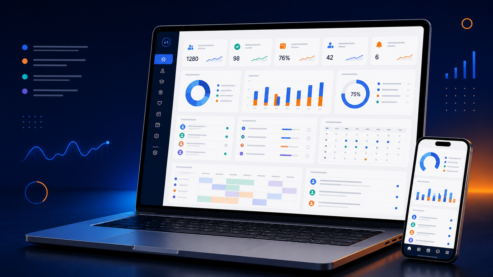
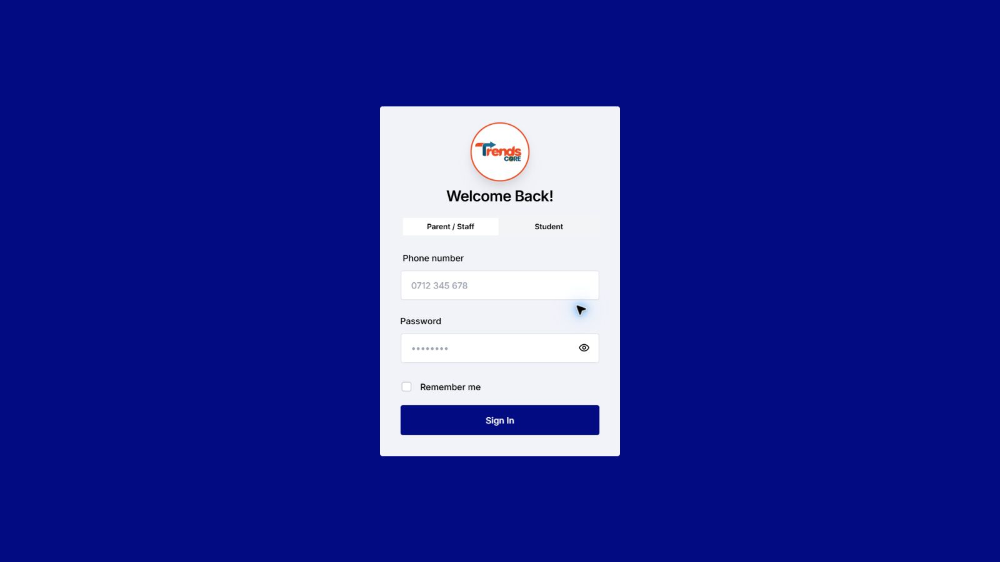
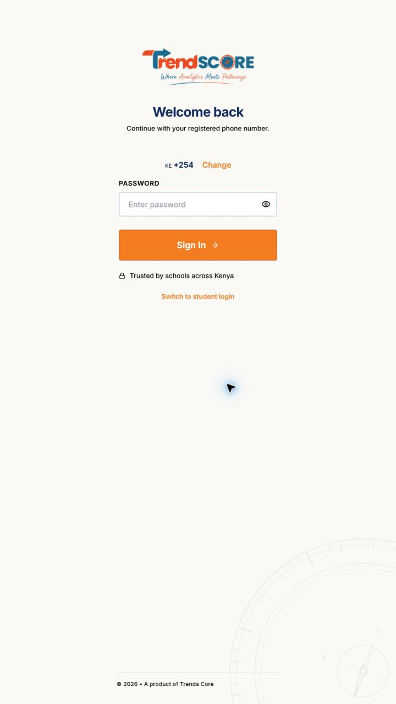

# TrendScore

<p align="center">
  
</p>

<p align="center">
  <strong>Where analytics meets pathways.</strong><br />
  A multi-tenant school operations platform for Kenyan CBE schools.
</p>

<p align="center">
  <a href="https://www.trendscore.co.ke/">Website</a> ·
  <a href="#product-experience">Product experience</a> ·
  <a href="#platform-catalogue">Platform catalogue</a> ·
  <a href="#guided-pathways">Guided Pathways</a> ·
  <a href="#local-development">Run locally</a> ·
  <a href="#deployment">Deployment</a>
</p>

<p align="center">
  
  
  
  
</p>

<p align="center">
  
</p>

TrendScore brings the everyday work of a school into one secure, role-aware platform: learner records, CBE assessment, finance, people operations, communication, reporting, approvals, and learner pathways guidance. It is designed to support individual schools through school-scoped configuration and controlled deployments.

> **Project status:** The core ERP and Guided Pathways workflows are actively implemented and evolving. Provider-backed integrations and future products are called out explicitly below so the catalogue distinguishes current capability from roadmap direction.

## Module readiness

**Status guide:** **Complete** means an end-to-end workflow is implemented in this repository; it still requires each school’s configuration, data, permissions, and release validation. **WIP** means the capability exists but is being expanded, hardened, or prepared for broader production use. **Not started** means there is no end-to-end product workflow yet.

| Module | Readiness | Current position |
| --- | --- | --- |
| Institution setup, branding, users, roles, and permissions | **Complete** | School setup, role-aware navigation, module access, account lifecycle, and authentication flows are implemented. |
| Learners, guardians, admissions, classes, streams, and documents | **Complete** | Core learner and family operating records are implemented. |
| CBE academics, assessment, grading, and report cards | **Complete** | Formative and summative workflows, scoring, status codes, reporting, and score governance are implemented. |
| Guided Pathways | **WIP** | Full Grade 7–9 learner, parent, counsellor, and admin lifecycle is implemented; ongoing UAT, catalogue quality, and rollout hardening remain. |
| Fees, invoicing, receipts, M-Pesa, and reconciliation | **WIP** | Core finance and provider-backed payment flows exist; payment callback and reconciliation hardening remains important. |
| Internal accounting and payroll posting | **Complete** | Internal ledger, journals, expenses, payroll posting, bank imports, and reconciliation are implemented. |
| External accounting connectors (QuickBooks, Xero, Sage) | **Not started** | No external-accounting adapter or synchronization workflow exists. |
| HR, staff, leave, attendance, payroll, and duty roster | **Complete** | Operational people workflows are implemented. |
| Biometric and face attendance | **WIP** | Phone face-liveness and ZKTeco integration paths are implemented; hardware rollout, consent, AWS setup, and device validation remain school-specific. |
| Timetable, planner, schemes of work, transport, boarding, inventory, assets, and library | **Complete** | Core operational module flows are implemented. |
| LMS and Digital Learning Hub | **WIP** | Courses, lessons, assignments, submissions, marking, resources, progress, analytics, and marketplace foundations exist; Digital Campus expansion continues. |
| Notices, SMS, email, broadcasts, notifications, and templates | **Complete** | Provider configuration, templates, contact groups, inboxes, notifications, and delivery workflows are implemented. |
| WhatsApp outbound notifications and reports | **WIP** | Official Meta Cloud API outbound adapter and legacy QR/Baileys sender are present; production consolidation is still required. |
| School inside WhatsApp (inbound parent self-service) | **WIP** | Architecture and outbound foundation exist, but secure inbound conversation, identity, and parent-service workflows remain to be built. |
| AI intelligence and in-app copilot | **WIP** | Deterministic intelligence, provider-backed chat, permissioned tools, and LMS AI features exist; additional tool coverage and governance hardening continue. |
| USSD self-service | **Not started** | No menu, session, identity, or transaction flow has been implemented. |
| Voice / VOIP | **Not started** | No SIP, WebRTC, telephony adapter, calling UI, recording, or call-log workflow has been implemented. |
| Mobile native apps | **Not started** | The web application is responsive and PWA-capable; separate native apps are not implemented. |
| Creators Hub | **Not started** | Product direction exists, but no complete standalone creator workflow has been released. |

## At a glance

| Who it helps | What they can do |
| --- | --- |
| School leaders | Monitor operations, performance, finance, approvals, and school-wide activity. |
| Teachers and counsellors | Manage classes, attendance, assessments, reports, learner guidance, and review queues. |
| Parents and guardians | Follow learner progress, fees, notices, reports, and pathway decisions. |
| Learners | Access learning and assessment information, complete pathway discovery, and make informed decisions. |
| Finance and operations teams | Run billing, payments, inventory, transport, HR, payroll, and records workflows. |

## Product experience

<p align="center">
  
</p>

<p align="center"><em>One connected operating view for school leaders, teams, and families.</em></p>

<table>
  <tr>
    <td width="50%" valign="top">
      
      <br /><br />
      <strong>Guided Pathways</strong><br />
      Discovery, family review, counselling, approval, and a recorded learner decision.
    </td>
    <td width="50%" valign="top">
      
      <br /><br />
      <strong>Every school role, connected</strong><br />
      Operational insight for leaders, practical workflows for staff, and accessible touchpoints for parents and learners.
    </td>
  </tr>
</table>

> **About these visuals:** they are product-vision illustrations created for this catalogue, not screenshots of live functionality. The module-readiness table remains the source of truth for what is implemented, in progress, and planned.

<details>
<summary><strong>Current responsive sign-in captures</strong></summary>
<br />

<p align="center">
  
</p>

<p align="center">
  
</p>
</details>

> Add representative, anonymised captures of the executive dashboard, assessment workspace, parent portal, and Pathways Decision Centre to `public/screenshots/` as those views are ready for public presentation. Replace the conceptual visuals above only when there are polished public-safe captures that better demonstrate the live product.

## Platform catalogue

### School foundation

| Area | Capabilities |
| --- | --- |
| Institution setup | School profile, branding, academic years, terms, institution types, module gating, first-login setup, and school-specific settings. |
| Identity and access | Superadmin bootstrap, user lifecycle management, roles, permissions, role preview, account switching, session controls, and protected routes. |
| Learner and family records | Admissions, learner profiles, guardian links, class and stream placement, progression, exits, documents, and account synchronisation. |
| Dashboards | Responsive dashboards and role-specific views for owners, administrators, teachers, accountants, parents, and learners. |

### Academics and CBE assessment

| Area | Capabilities |
| --- | --- |
| Curriculum setup | Learning areas, strands, sub-strands, scales, competency structures, classes, streams, subjects, and teacher assignments. |
| Formative assessment | Observations, rubric-based scoring, values, core competencies, co-curricular activities, comments, and learner growth records. |
| Summative assessment | Test setup, marks entry, bulk imports, performance bands, ranking, completion tracking, analytics, and printable report cards. |
| Assessment governance | Score locking, controlled unlock requests, approval routing, administrative status codes, and audit history. |
| Reports and intelligence | Term reports, learner profiles, class summaries, learning-area analysis, academic insights, risk signals, and report distribution. |

### Guided Pathways

TrendScore includes an end-to-end Grade 7–9 decision workflow that turns learner evidence into a shared, auditable guidance process.

1. Administrators publish pathways, tracks, combinations, careers, schools, and current recommendation rules.
2. Learners complete a guided discovery wizard with autosave and resume support.
3. The platform presents evidence-based recommendations, alternatives, careers, subject combinations, and school matches.
4. Learners build and submit a decision plan for parent review.
5. Parents contribute family preferences, comments, approvals, or revision requests.
6. Teachers or counsellors add guidance, action plans, and review decisions.
7. Administrators monitor the funnel, correct reference data, approve, and lock final decisions.

The workflow keeps submission snapshots, revision history, notifications, role boundaries, audit records, and locked-plan protection. See [the Pathways end-to-end scenario](pathways/E2E-Pathways-G7-G9-Test-Scenario.md) for UAT coverage across Grade 7, 8, and 9 journeys.

### Finance, accounting, and payments

| Area | Capabilities |
| --- | --- |
| Fees | Fee structures, invoices, balances, statements, receipts, waivers, adjustments, pledges, imports, and family-facing fee visibility. |
| Payments | Payment recording, unmatched-payment handling, reconciliation workflows, M-Pesa/Daraja service integration paths, and payment reporting. |
| Accounting | Internal double-entry accounting: chart of accounts, journals, journal entries, vendor and expense management, automated fee-invoice, fee-payment, and payroll ledger posting, bank-statement import, suggested matching, reconciliation, and financial reports. |
| Payroll | Staff payroll generation, confirmation, payment tracking, and accounting integration hooks. |

### People and school operations

| Area | Capabilities |
| --- | --- |
| HR | Staff profiles, documents, leave, attendance, duty rosters, teacher assignments, and payroll workflows. |
| Attendance | Learner and staff attendance, absence tracking, parent alerts, presence reporting, and biometric terminal integration paths. |
| Timetable and planning | Timetable management, schemes of work, calendars, planner workflows, and scheduling helpers. |
| Transport and boarding | Routes, drivers, learner assignments, trips, transport fees, tracking views, and boarding or hostel foundations. |
| Resources | Inventory, assets, uniforms, library catalogue and circulation, resource libraries, and document management. |

### Communication, support, and engagement

| Area | Capabilities |
| --- | --- |
| School communication | Notices, messages, broadcasts, SMS, provider-configured email, WhatsApp service paths, report sharing, fee reminders, attendance alerts, contact groups, inbox/read receipts, and SMS balance or top-up workflows. |
| Notifications | In-app and push-notification foundations, realtime Socket.IO events, user notification controls, and deep links. |
| Support | Support hub, contextual module guides, role onboarding journeys, AI-assistant interface foundations, and system logs. |
| Learning Management System | Course management and enrolment, lesson authoring with ordered content blocks and media upload, learner progress, sessions, assignments, draft and file submissions, marking and return-for-correction, revision resources, bookmarks, analytics, leaderboards, and learner or parent views. |

### Governance, security, and platform operations

| Area | Capabilities |
| --- | --- |
| Approvals | Configurable multi-step workflows, role or named-user approvers, request dashboard, assigned-action queue, approval, rejection, cancellation, superadmin override, notifications, full request history, and score-unlock governance. |
| Auditability | School-scoped logs, approval history, pathway decision history, operational records, and administrative traceability. |
| Security | Role and permission guards, tenant-aware access control, safeguarded impersonation, session polling, force logout, and inactivity controls. |
| Biometric attendance | Consent-gated AWS Rekognition face-liveness enrolment for learners and staff, encrypted credential handling, registered phone terminals and supported ZKTeco pull-mode devices, one-time activation, device-token rotation, connection testing, face attendance events, fallback attendance, offline terminal queue/retry, and audit-ready device and event logs. |
| Reliability | Backups, restore/reset workflows, health checks, database tools, service-worker versioning, and PWA support. |

## Product direction

| Product area | Status | Direction |
| --- | --- | --- |
| School ERP | Active | The main school operating system: academics, finance, people, operations, reporting, and governance. |
| Guided Pathways | Active | Evidence-led learner discovery, school and career exploration, family review, counselling, and locked decisions. |
| Digital Campus | In progress | Richer online learning, learner workspaces, assignments, content, and remote engagement. |
| Creators Hub | Planned | A school-approved ecosystem for educator resources, lessons, assessments, and reusable templates. |
| Mobile apps | Planned | Dedicated parent and teacher mobile experiences for alerts, reports, fees, attendance, and communication. |
| USSD self-service | Planned | A provider-backed low-bandwidth channel for parent and school self-service; not yet implemented as a public platform workflow. |
| Voice and VOIP | Planned | A provider-backed calling channel for school-office, staff, and family communication; not yet implemented as a SIP, WebRTC, or telephony workflow. |

### Approvals and school governance

TrendScore uses a central approval engine for actions that need accountable review rather than silent changes.

1. An authorised user submits a request against a configured school workflow.
2. The engine resolves the current approval step to designated roles or named users.
3. Approvers receive an assigned-action queue, request detail, workflow-step visualisation, and contextual notifications.
4. Each approver can approve or reject with a recorded decision; requesters can cancel eligible requests.
5. The system advances through multi-step approval chains or records the terminal decision.
6. School leaders can monitor pending work, awaiting-my-action items, submitted work, approvals, rejections, and historical records.
7. A superadmin override is deliberately recorded where exceptional intervention is authorised.

This engine is used for governance-sensitive actions such as controlled score unlocks and complements the locked-decision workflow in Guided Pathways.

### LMS and Digital Learning Hub

The LMS is more than a placeholder: it gives teachers a controlled publishing workflow and gives learners an activity trail from course enrolment to marked work.

1. Teachers create courses and enrol learners.
2. Teachers build draft lessons with ordered content blocks, then publish them when ready.
3. Learners access enrolled courses, complete lesson blocks, and build visible progress records.
4. Teachers create, publish, close, and mark assignments; learners can save draft work, submit files, and receive returned work for correction.
5. Schools curate a revision library with upload, search, bookmarks, signed downloads, and archived content.
6. Learning analytics provide course, class, learner, lesson-engagement, assignment, achievement, and leaderboard views.

Enterprise-gated workflows include a moderated learning-resource marketplace, M-Pesa purchase handling, and rate-limited AI learning tools such as explanation, practice, flashcards, lesson-plan generation, assignment generation, and rubric generation.

### Biometric attendance and face enrolment

TrendScore’s biometric module is a governed attendance workflow, not simply a device connector.

1. A school administrator registers a terminal, tests its connection, and creates a one-time activation code.
2. The terminal is activated with a device-scoped token; platform biometric encryption and AWS credentials are never placed on the terminal.
3. An authorised staff member starts consent-gated face enrolment for a learner or staff member.
4. AWS Rekognition face-liveness validates the enrolment; the platform retains credential metadata rather than exposing biometric templates.
5. An activated terminal records face attendance events, supports documented fallback attendance when recognition is unavailable, and queues/retries events when offline.
6. Administrators review device state, enrolment state, logs, pending events, and configuration diagnostics; credentials can be revoked and terminals decommissioned when required.

### AI and intelligence

TrendScore combines deterministic school analytics with configurable AI-assisted experiences. Deterministic intelligence surfaces academic trends, attendance anomalies, fee-collection forecasts, learner risk signals, and plain-language recommendations from live school data. These insights can run without an external AI provider.

When a school enables an approved provider, the platform supports an in-app AI copilot with contextual chat history and navigation support, plus AI-assisted report comments and communications. The provider layer supports OpenAI and Anthropic configuration through school communication settings and environment-managed credentials.

The LMS adds enterprise-gated, rate-limited AI learning tools for age-appropriate explanation, simplification, flashcards, practice, mistake explanation, and generation support for lessons, assignments, and rubrics. AI features are permission-gated and should be enabled only after the school has configured its provider, data controls, and operating policy.

### USSD direction

USSD is listed as a planned low-bandwidth self-service channel for families and school communities. The present codebase includes SMS-provider configuration and a provider response field for a USSD account, but does **not** yet expose a complete USSD menu, session, authentication, or transaction workflow. It is therefore intentionally represented as roadmap work rather than a completed feature.

### Communication and VOIP direction

Today, TrendScore supports school-scoped SMS and email provider configuration, WhatsApp service integration paths, notices, broadcast recipients and contact groups, inbox/read receipts, SMS balance and top-up workflows, birthday messaging, report distribution, in-app notifications, and realtime events. Communication settings include provider testing and AI-assisted email drafting.

Voice and VOIP are a planned extension of this communication layer. The repository does **not** currently contain a SIP client, WebRTC calling interface, telephony provider adapter, call routing, call recording, or call-log workflow, so the catalogue does not present VOIP as shipped functionality. A future implementation should use a provider adapter with school-scoped credentials, consent and retention controls, role-based call permissions, audit logs, and links back to the relevant learner, family, or support record.

### School inside WhatsApp — readiness and implementation path

TrendScore is preparing to let verified parents use key school services directly in WhatsApp. This is **WIP**, not a released parent self-service channel.

| Layer | Current readiness | Notes |
| --- | --- | --- |
| Official Meta provider | **WIP** | The WhatsApp Cloud API adapter sends text and approved templates, including absence notifications, when `WABA_*` credentials are configured. |
| Legacy sender | **WIP** | A QR/Baileys service supports report sharing, tests, and staff-initiated sends; it should be migrated behind a provider flag and retired from production parent journeys. |
| Inbound webhook | **Not started** | The adapter can verify Meta’s GET challenge, but `/api/webhooks` currently mounts SMS callbacks only—there is no signed WhatsApp POST handler. |
| Parent identity | **Not started** | Parent-to-learner access rules exist, but a WhatsApp phone-number binding, verification, and recovery process is not yet implemented. |
| Parent conversation | **Not started** | There is no WhatsApp conversation state, durable message inbox, delivery-status processing, idempotency store, or human-handoff workflow. |
| Read-only parent services | **Not started** | The existing parent, fee, attendance, report, and Pathways services need channel-safe, parent-scoped adapters. |
| Conversational payments and approvals | **Not started** | These require canonical payment handling, explicit confirmation, idempotency, and audit guarantees before exposure in WhatsApp. |

The target flow is deliberately channel-neutral so WhatsApp, future USSD, the parent portal, and a mobile app can use the same authorised business services:

```text
Parent WhatsApp
  → Meta Cloud API signed webhook
  → verify signature + deduplicate provider message ID
  → resolve school from business phone number
  → bind and verify parent identity
  → conversation/session and human-handoff layer
  → permission-checked TrendScore domain service
  → audited reply, approved template, or confirmation prompt
```

Recommended delivery sequence:

1. Keep official Meta Cloud API in **outbound-only** mode for absent-learner alerts, fee reminders, report-ready notices, and approval notifications.
2. Add signed inbound webhook ingestion, normalized messages and statuses, durable inbox records, deduplication, monitoring, and a support handoff—without exposing school data yet.
3. Add a parent linking flow: the parent confirms their WhatsApp number through the parent portal or an OTP, then is limited to linked active learners.
4. Release a numbered, read-only menu for verified parents: fee balance, attendance summary, report availability, notices, and Pathways status.
5. Add AI only as a presentation layer over permission-checked tools; it must never access Prisma or issue direct database mutations.
6. Add write or financial actions only with explicit confirmation, idempotency keys, audit logs, a clear rollback path, and human escalation.

The detailed architecture, security gates, rollout phases, and test expectations are maintained in [the AI-native WhatsApp transformation audit](docs/AI_TRANSFORMATION_AUDIT.md). Do not expose live learner data or conversational payment actions until its Phase 0 and inbound-channel controls are complete.

### Email services and template creation

Each school can configure and test its own communication providers from Communication Settings. The application supports **Resend** and SMTP-compatible email delivery, plus configurable SMS providers. Schools can set sender identity, provider credentials, and enabled or disabled status without exposing those credentials to ordinary users.

Email workflows support operational templates such as welcome, onboarding, fee invoice, fee statement, parent portal, scheme review, fee-waiver, and generic messages. Administrators can test email delivery and use AI-assisted drafting to produce or refine a template from its audience, goal, tone, and current content. Templates should remain school-approved before use in a live broadcast.

### School equipment and services

TrendScore is web-based: a school does **not** need specialist hardware to run the core ERP. This guide separates baseline requirements from optional equipment tied to specific modules.

| Category | What is needed | Used for |
| --- | --- | --- |
| Core access | Internet-connected desktop, laptop, tablet, or modern smartphone with a current browser | All dashboards, records, assessment, finance, communication, and reporting workflows. |
| Network and continuity | Reliable internet, secure school Wi-Fi/LAN, power protection or UPS where practical, and a local connectivity fallback plan | Daily availability, device connectivity, cloud services, and reliable data capture. |
| Printing and documents | A standard A4 printer; optionally a thermal receipt printer | Report cards, invoices, statements, ID cards, and point-of-payment receipts. |
| Biometric attendance | A managed Android/iOS phone terminal with camera for face-liveness, or a supported networked ZKTeco attendance terminal; documented consent and stable local network | Automated learner or staff attendance. |
| Transport | Driver smartphone with location access; optional vehicle GPS hardware supplied by the school or provider | Trip events, transport workflows, and tracking views. |
| Payments | M-Pesa/Daraja business credentials and approved callback configuration | STK/payment reconciliation and fee-payment workflows. |
| Communication | SMS-provider account, Resend or SMTP email account, and optional WhatsApp Business credentials | Parent alerts, broadcasts, receipts, reports, and two-way communication paths. |
| Cloud AI and face services | Optional OpenAI or Anthropic credentials for AI features; AWS Rekognition credentials and biometric-encryption key for face workflows | AI copilot/LMS assistance and face-liveness enrolment. |

Do not place server credentials, AWS keys, biometric-encryption keys, or school provider secrets on shared terminals. Use school-scoped configuration and least-privilege roles instead.

### Accounting integration boundary

TrendScore currently provides its **own integrated accounting ledger**, rather than a connector to an external accounting suite. Fees, payments, expenses, and payroll can post into the internal chart of accounts and journals; finance teams can import bank statements, review suggested journal matches, reconcile lines, and produce accounting reports inside TrendScore.

The repository does **not** currently include QuickBooks, Xero, Sage, or external ERP export/import connectors. If an external-accounting integration is needed, it should be added as a deliberate provider adapter with mapped chart-of-account codes, idempotent sync, reconciliation rules, error queues, audit logs, and a clear system-of-record policy.

## Architecture

TrendScore is maintained as a modular monorepo.

| Path | Purpose |
| --- | --- |
| [`src/`](src) | React application, UI components, state stores, API clients, and role-based experiences. |
| [`server/`](server) | Express API, Prisma schema, routes, services, controllers, jobs, scripts, and tests. |
| [`public/`](public) | Application assets, PWA metadata, service-worker files, branding, and screenshots. |
| [`pathways/`](pathways) | Pathways UAT scenarios and implementation-supporting material. |
| [`deploy/`](deploy) | Instance manifest and school deployment operating documentation. |
| [`.github/workflows/`](.github/workflows) | CI, Docker publishing, promotion, storage maintenance, and biometric verification workflows. |
| [`docs/`](docs) | Architecture, audit, and product documentation. |

### Technology

- **Frontend:** React 18, Vite, React Router, Zustand, Radix UI, Tailwind utilities, Recharts.
- **Backend:** Node.js, Express, TypeScript, Prisma ORM, Zod.
- **Data and realtime:** PostgreSQL, Socket.IO, Redis-ready caching architecture.
- **Integrations:** M-Pesa/Daraja, SMS, email, WhatsApp, web push, Cloudinary, AWS Rekognition.
- **Operations:** Docker, GitHub Actions, controlled school-instance promotion, health checks, and backups.

## Local development

### Prerequisites

- Node.js 18 or newer
- npm 9 or newer
- PostgreSQL
- A configured backend environment file

### Setup

```bash
git clone https://github.com/Amalgamate/trendscore.git
cd trendscore

npm install
npm --prefix server install

cp .env.example .env
cp server/.env.example server/.env

npm --prefix server run prisma:generate
npm --prefix server exec prisma migrate deploy
```

For Windows PowerShell, use `Copy-Item .env.example .env` and `Copy-Item server/.env.example server/.env` instead of `cp` if needed.

Before the first backend startup, configure at least the following in `server/.env`:

```dotenv
DATABASE_URL=postgresql://...
JWT_SECRET=use-a-strong-secret
JWT_REFRESH_SECRET=use-a-different-strong-secret
SUPER_ADMIN_EMAIL=admin@example.com
SUPER_ADMIN_PASSWORD=use-a-strong-password
```

Never commit real credentials, API keys, biometric-encryption keys, or production database URLs.

### Run locally

```bash
npm run dev
```

This starts both services:

| Service | Address |
| --- | --- |
| Frontend | <http://localhost:3000> |
| Backend API | <http://localhost:5000> |
| Health check | <http://localhost:5000/api/health> |

Useful alternatives:

```bash
npm run dev:full      # Start the frontend after the API is reachable
npm run dev:fast      # Faster local boot with reduced bootstrap work
npm run kill-ports    # Release development ports
npm run build         # Create a production frontend build
```

## Quality, tests, and operational commands

```bash
# Frontend
npm run lint
npm run test:ui
npm run audit:design-system
npm run audit:api-contract

# Backend
npm --prefix server run lint
npm --prefix server run test
npm --prefix server exec tsc --noEmit
npm --prefix server exec prisma validate
npm --prefix server run audit:responses
```

Useful non-production data and operations commands:

```bash
npm run seed:demo
npm --prefix server run seed:evaluation-personas
npm --prefix server run seed:ss:pathways
npm --prefix server run seed:careers
npm --prefix server run backup
npm --prefix server run provision
```

Use seed data only in local, test, or explicitly approved demo environments.

## Deployment

TrendScore separates image publishing from school deployment. GitHub Actions can build and publish Docker images, but school deployments are manual, target one approved instance at a time, and are checked against [`deploy/instances.manifest.json`](deploy/instances.manifest.json).

Before a promotion proceeds, the workflow validates the selected school, environment, and deployment permission, then runs a scoped migration, deployment, and health check.

Read the operating guides before deploying:

- [Deployment workflow](deploy/WORKFLOW.md)
- [Deployment model](deploy/DEPLOYMENT.md)
- [Promotion workflow](.github/workflows/promote-release.yml)

## Security notes

- Keep `.env` files and all credentials outside version control.
- Use different JWT secrets and provider credentials for every environment.
- Enable HTTPS, secure cookies, restrictive CORS, rate limiting, and CSP in production.
- Treat role, tenant, parent-learner, and teacher-assignment boundaries as server-enforced controls.
- Use the Pathways UAT scenario to test cross-role and cross-tenant access control before release.
- Follow the [AI-native WhatsApp transformation audit](docs/AI_TRANSFORMATION_AUDIT.md) before expanding conversational or payment automation capabilities.

## License and ownership

Copyright 2026 TrendScore. Managed by Amalgamate.
