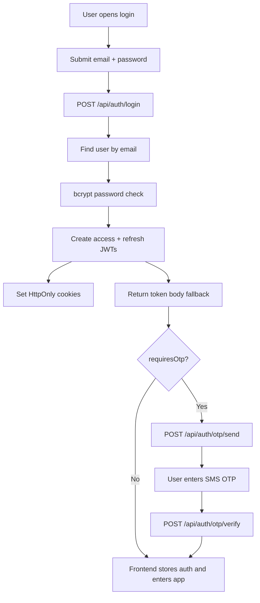
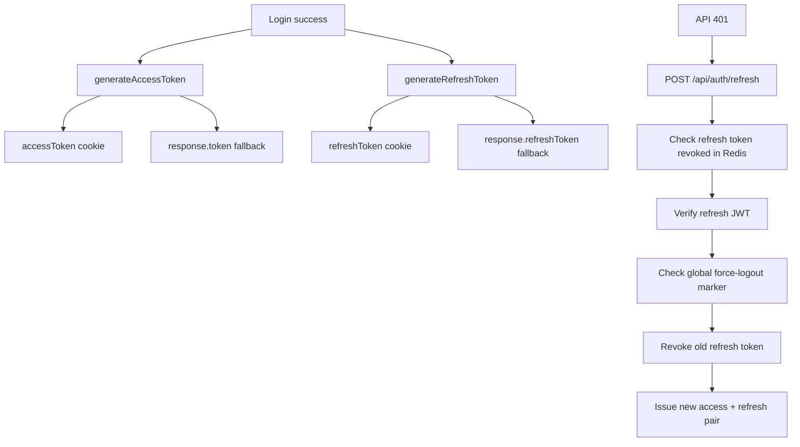
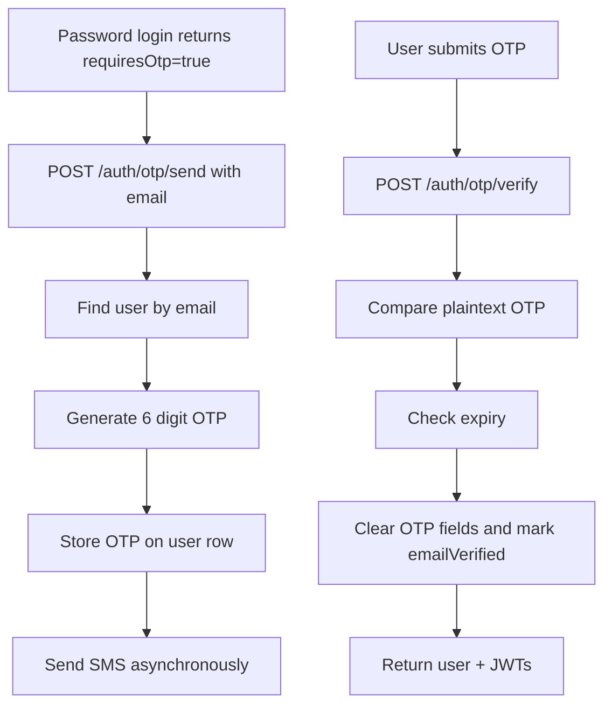
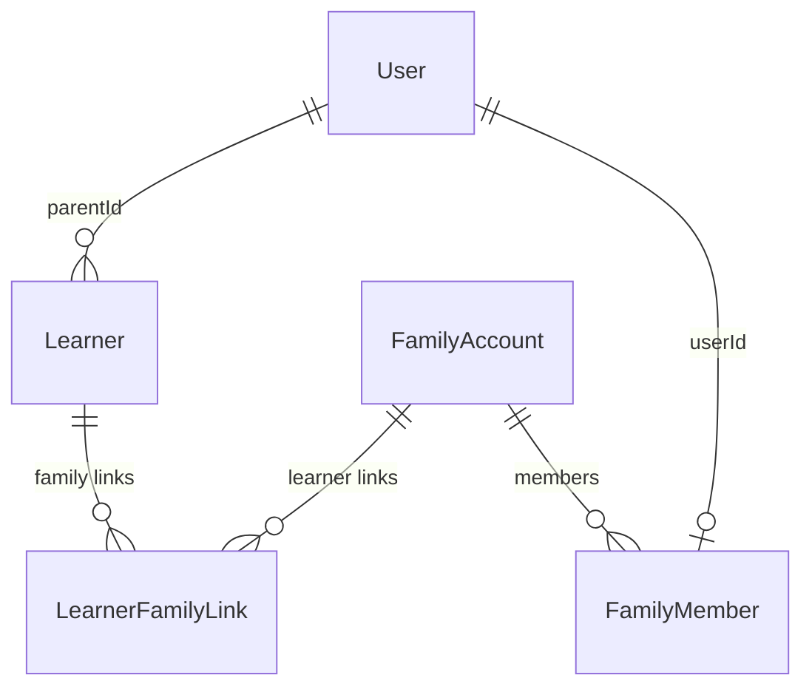

# Phase 0 Report

## Summary

TrendSCORE currently uses email/password authentication with JWT access and refresh tokens. OTP exists, but it is a second factor after password verification, not a phone-only/passwordless parent login flow.

Parents are modeled primarily as `User` rows with `role=PARENT`. Learners link to one primary parent through `Learner.parentId`, while extra contact fields store mother, father, guardian, emergency, and primary-contact details. Newer `FamilyAccount`, `FamilyMember`, and `LearnerFamilyLink` tables exist, but the main parent portal and access checks still rely mostly on `Learner.parentId`.

The PWA foundation exists through a manifest, production service worker, cache strategies, and Web Push infrastructure. Offline behavior is limited to cached GET responses and shell fallback. There is no IndexedDB-backed parent cache, offline mutation queue, background sync, or conflict handling.

Phase 1 is safe to begin as a refactor-only phase if it stays inside auth core boundaries and preserves all existing behavior.

## Files Reviewed

- `server/src/controllers/auth.controller.ts`
- `server/src/routes/auth.routes.ts`
- `server/src/middleware/auth.middleware.ts`
- `server/src/middleware/permissions.middleware.ts`
- `server/src/services/auth-session.service.ts`
- `server/src/services/otp.service.ts`
- `server/src/controllers/otp.controller.ts`
- `server/src/services/parent.service.ts`
- `server/src/services/sms.service.ts`
- `server/src/services/notification.service.ts`
- `server/src/controllers/userNotification.controller.ts`
- `server/src/routes/userNotification.routes.ts`
- `server/src/controllers/dashboard.controller.ts`
- `server/src/controllers/learner.controller.ts`
- `server/prisma/schema.prisma`
- `src/components/auth/LoginForm.jsx`
- `src/components/auth/OTPVerificationForm.jsx`
- `src/contexts/AuthContext.jsx`
- `src/services/api/axiosConfig.js`
- `src/services/api/auth.api.js`
- `src/contexts/UserNotificationContext.jsx`
- `src/index.jsx`
- `public/manifest.json`
- `public/sw.js`

## Authentication Flow

Current method:

- Login identifier is email.
- Password is required.
- OTP is post-password verification for most non-superadmin/non-student roles.
- Parent login email may be derived from phone as `<digits>@<product-domain>`, but the login form still asks for email and password.

## API Inventory

Auth routes:

- `POST /api/auth/register`
- `POST /api/auth/check-availability`
- `POST /api/auth/login`
- `POST /api/auth/refresh`
- `POST /api/auth/forgot-password`
- `POST /api/auth/reset-password`
- `POST /api/auth/otp/send`
- `POST /api/auth/otp/verify`
- `POST /api/auth/send-whatsapp-verification`
- `GET /api/auth/me`
- `POST /api/auth/logout`
- `POST /api/auth/logout-all`
- `POST /api/auth/flush-cache`

Parent-facing supporting routes:

- `GET /api/dashboard/parent`
- `GET /api/learners/parent/:parentId`
- `PATCH /api/learners/:id/parent-update`
- `GET /api/user-notifications`
- `POST /api/user-notifications/push-subscription`
- `GET /api/user-notifications/vapid-public-key`

## Middleware Inventory

- `authenticate`: reads Bearer token or `accessToken` cookie, verifies JWT, normalizes role fields, attaches `req.user`.
- `optionalAuthenticate`: same token handling but allows anonymous requests.
- `authorize`: role-based route guard.
- `requirePermission`: permission-name guard.
- `requireAnyPermission`: any-of permission guard.
- `requireRole`: role guard.
- `ResourceAccessControl.canAccessLearner`: parent learner access is allowed only when `learner.parentId === req.user.userId`.
- `auditLog`: writes `AuditLog` records for selected sensitive operations.

## JWT And Session Flow

Notes:

- Access token default expiry is configured in `jwt.util.ts`; cookie max age is 60 minutes in `auth.controller.ts`.
- Refresh token default expiry is 7 days.
- Refresh rotation exists.
- Used refresh tokens are revoked through Redis keys.
- Global force logout exists through `auth-session.service.ts`.
- Frontend stores tokens in localStorage as fallback and also relies on cookies through `withCredentials`.

## OTP Flow

Current limitations:

- OTP is looked up by email, not phone.
- OTP is stored directly in `User.phoneVerificationCode`, not hashed.
- There is a resend cooldown, but no durable per-phone attempt counter or OTP lockout table.
- SMS send failure does not fail the OTP request.
- Super admin and development skip paths exist.

## Parent Account Model

Parents are normal users:

- `User.role = PARENT`
- `User.roles` can include `PARENT`
- `User.phone` is optional and not globally unique.
- Parent login email is generated from normalized phone digits by `buildParentLoginEmail`.
- Auto-created parent accounts get a temporary password and `passwordResetToken` to force password change.

Current parent login answer:

- Can parents log in? Yes, if they have a parent user account and credentials.
- Can parents reset password? Yes through email/token reset, but synthetic phone-derived emails are awkward for real parent UX.
- Can parents use OTP? Yes, after password login.
- Can parents log in with phone only? No.
- Can parents log in with email? Yes, including generated phone-domain login emails.
- Can parents have multiple linked students? Yes, if multiple learners point to the same `parentId`.
- Can parents switch between students? The portal displays multiple children from `/dashboard/parent`.
- Can one account span multiple schools? Not cleanly in the current single-tenant fallback model.

## Parent Relationship Model

Learner stores:

- `parentId`
- `guardianName`, `guardianPhone`, `guardianEmail`
- `fatherName`, `fatherPhone`, `fatherEmail`, `fatherDeceased`
- `motherName`, `motherPhone`, `motherEmail`, `motherDeceased`
- `guardianRelation`
- `primaryContactType`, `primaryContactName`, `primaryContactPhone`, `primaryContactEmail`
- `emergencyContact`, `emergencyPhone`

Family tables support richer modeling:

- `FamilyAccount`
- `FamilyMember`
- `LearnerFamilyLink`

Gap:

- Core access checks and dashboard queries still mostly use `Learner.parentId`.
- Independent mother/father/guardian login through `FamilyMember` is not fully wired into portal authorization.

## Role And Permission Flow

Roles come from JWT payload and are normalized at the auth boundary.

Parent permissions include:

- `VIEW_OWN_CHILDREN`
- `VIEW_CHILDREN_REPORTS`
- `VIEW_CHILDREN_ATTENDANCE`
- `VIEW_OWN_BALANCE`
- message inbox access
- parent-visible fee access

Route/resource access for parents is enforced by checking learner ownership through `parentId`.

## PWA, Offline, And Push Readiness

PWA:

- `public/manifest.json` exists.
- `public/sw.js` exists.
- Service worker is registered only in production by `src/index.jsx`.
- App shell cache exists.
- Static asset cache exists.
- API GET network-first cache exists.
- Service worker update check exists.

Offline:

- Cached shell may load offline after successful install.
- Cached GET API responses may be served.
- No IndexedDB store was found for parent portal data.
- No offline login.
- No background sync.
- No write queue.
- No conflict resolution.

Push:

- Browser Notification API is used in `UserNotificationContext`.
- Web Push subscription creation exists.
- VAPID backend support exists.
- `PushSubscription` table exists.
- Service worker handles `push` and `notificationclick`.
- Push is skipped if VAPID keys are missing.

## SMS Integration

SMS providers:

- MobileSasa
- Africa's Talking

Configuration sources:

- `CommunicationConfig`
- Environment variable fallback for selected providers

SMS capabilities:

- Phone validation for Kenyan numbers.
- Phone formatting to `+254...`.
- Assessment report SMS.
- Fee invoice notification SMS.
- Bulk SMS.
- OTP SMS through `OtpService`.

Gaps:

- No dedicated OTP delivery table.
- OTP SMS delivery failure is non-blocking.
- Delivery tracking is stronger for assessment audit than for auth OTP.
- No multi-provider failover chain beyond DB/env provider choice.

## Security Findings

1. OTP is stored in plaintext on the `users` table.
2. Parent passwordless login does not exist; OTP is currently second factor after password.
3. `User.phone` is optional and not globally unique.
4. Phone normalization differs between parent login helpers and SMS helpers.
5. Password lockout constants are effectively disabled in `auth.controller.ts`.
6. Tokens are stored in HttpOnly cookies but also returned and stored in localStorage fallback, increasing XSS impact.
7. No trusted-device table or device revocation UI exists.
8. No per-phone OTP abuse table exists.
9. No durable OTP attempt counter exists.
10. Parent authorization is still tied to one `Learner.parentId`, not all family members.
11. CSRF strategy is not clearly enforced for cookie-based auth.
12. Login history/device audit is limited.

## Duplicate Logic

Visible duplication/risk areas:

- Token/cookie handling is embedded in `AuthController` instead of a dedicated service.
- Refresh-token revocation helpers live inside `auth.controller.ts`.
- OTP verification can issue JWTs separately from normal login token issuance.
- Frontend stores tokens in multiple keys: `token`, `refreshToken`, and legacy `authToken`.
- Parent phone normalization exists in parent service and SMS service with different outputs.

## Dead Code

Likely stale or underused areas:

- `src/utils/registerSW.js` exists, but production registration is handled directly in `src/index.jsx`.
- `usePWAInstall` exists, but no usage was found in `src`.
- Some parent portal screens are live-backed; install prompt and offline UX are not visibly connected to the parent journey.

## Technical Debt

1. Auth controller owns too many responsibilities.
2. Parent identity is split across `User`, learner contact fields, and newer family tables.
3. OTP lifecycle needs its own secure persistence model.
4. Phone normalization needs one canonical helper shared by auth, parent import, SMS, and payment matching.
5. Session/device management is not enterprise-grade yet.
6. Offline readiness is cache-based only, not product-flow based.
7. Push notifications exist technically, but permission onboarding and parent preference management are incomplete.

## Recommendations

Start Phase 1 as a refactor-only phase:

1. Extract auth service boundaries without changing behavior.
2. Centralize cookie logic.
3. Centralize JWT and refresh-token logic.
4. Keep existing routes and response payloads unchanged.
5. Add tests around current behavior before any passwordless change.

Do not start phone-only OTP until auth core behavior is isolated and covered.

## Tests Executed

No automated tests were run. Phase 0 was inspection-only and modified documentation only.

## Rollback Strategy

Rollback is documentation-only: revert the migration-kit documentation changes. No production code, database schema, or runtime behavior changed.

## Acceptance Criteria Status

All Phase 0 checklist items are complete based on source inspection.

## Ready for Phase 1?
Yes.

Reason: current auth behavior is mapped clearly enough to begin a refactor-only Phase 1. Phase 1 must not change login behavior, OTP behavior, database schema, UI, or public API contracts.
