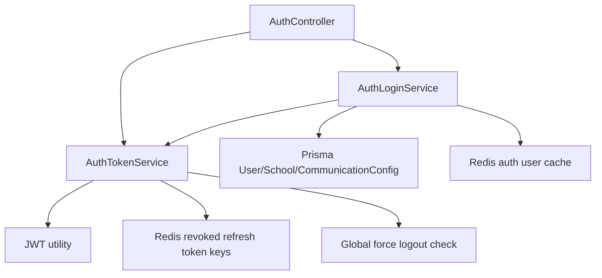

# Phase 1 Report

## Summary

Phase 1 completed a behavior-preserving authentication core refactor.

The auth controller no longer owns password-login business logic, token-cookie helpers, refresh-token revocation, or refresh-token rotation. Those responsibilities were extracted into focused services:

- `AuthLoginService`
- `AuthTokenService`

No database schema, API route, response contract, UI, OTP behavior, parent portal behavior, or public token field was changed.

## Files Changed

- `server/src/controllers/auth.controller.ts`
- `server/src/services/auth-login.service.ts`
- `server/src/services/auth-token.service.ts`
- `server/src/__tests__/authLogin.service.spec.ts`
- `server/src/__tests__/authToken.service.spec.ts`
- `login migrations/**/engineering/authentication/**`

## Architecture Changes

Controller responsibilities now:

- Read request payload.
- Call the relevant auth service.
- Set cookies when needed.
- Return the existing response shape.

Service responsibilities now:

- `AuthLoginService`: password login validation, cached user lookup, bcrypt check, login-attempt update, school verification gate, token issuance, response payload assembly.
- `AuthTokenService`: access/refresh token pair issuance, auth cookie set/clear, refresh-token revocation, refresh-token rotation.

## Behavior Compatibility Notes

Behavior intentionally preserved:

- `POST /api/auth/login` still requires `email` and `password`.
- Login still returns `token`, `refreshToken`, `requiresOtp`, `mustChangePassword`, `message`, and `user`.
- Existing OTP-after-password behavior is unchanged.
- Existing access-token and refresh-token field names are unchanged.
- Existing cookie names are unchanged: `accessToken`, `refreshToken`.
- Existing refresh-token revocation Redis key format is unchanged: `revoked_rt:<token>`.
- Existing refresh-token TTL is unchanged at 7 days.
- Existing logout response is unchanged.
- Existing `/auth/me` code path is unchanged.

## Duplicate Code Removed

- Removed local refresh-token revocation helpers from `auth.controller.ts`.
- Removed local cookie set/clear helpers from `auth.controller.ts`.
- Removed direct JWT generation from register/login/refresh controller paths.
- Removed password-login business logic from `auth.controller.ts`.

## Technical Debt Reduced

- Auth controller is significantly smaller.
- Token issuing and cookie behavior are centralized.
- Refresh-token rotation is testable independently.
- Password login is testable independently.
- Future passwordless login work can build beside `AuthLoginService` instead of expanding the controller.

## Tests Executed

- `npx tsc --noEmit`
- `npx jest src/__tests__/authToken.service.spec.ts src/__tests__/authLogin.service.spec.ts --runInBand`

Result:

- TypeScript passed.
- 2 Jest suites passed.
- 8 tests passed.

## Risks

- Full application test suite was not run.
- The refactor is behavior-preserving by construction and targeted tests cover extracted service behavior, but there may be untested auth edge cases outside the moved logic.
- Phase 2 must not start by replacing existing login; it should add a backward-compatible phone identity/OTP path beside the current flow.

## Rollback Plan

Revert the Phase 1 changed files:

- `server/src/controllers/auth.controller.ts`
- `server/src/services/auth-login.service.ts`
- `server/src/services/auth-token.service.ts`
- `server/src/__tests__/authLogin.service.spec.ts`
- `server/src/__tests__/authToken.service.spec.ts`

No database rollback is required because Phase 1 made no schema or data changes.

## Acceptance Criteria Status

- Controllers orchestrate auth services: complete for login/token/refresh/logout token handling.
- JWT creation centralized behind `AuthTokenService`: complete.
- Cookie handling centralized behind `AuthTokenService`: complete.
- Refresh-token rotation/revocation centralized behind `AuthTokenService`: complete.
- Existing login behavior unchanged: complete.
- Existing OTP-after-password behavior unchanged: complete.
- No API changes: complete.
- No UI changes: complete.
- No database changes: complete.
- Tests passing: complete.

## Ready for Phase 2?
Yes.

Reason: Auth core responsibilities are now separated enough to add the next passwordless/identity foundation phase without expanding the controller further. Phase 2 should be documented before implementation and should remain backward-compatible.
